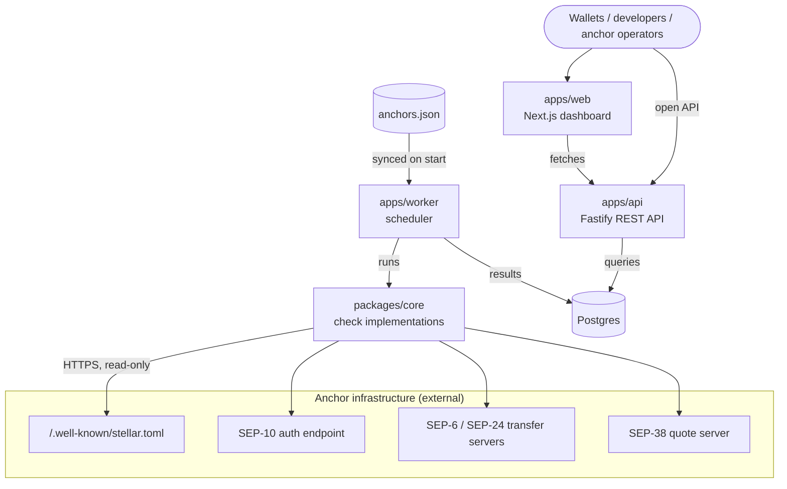
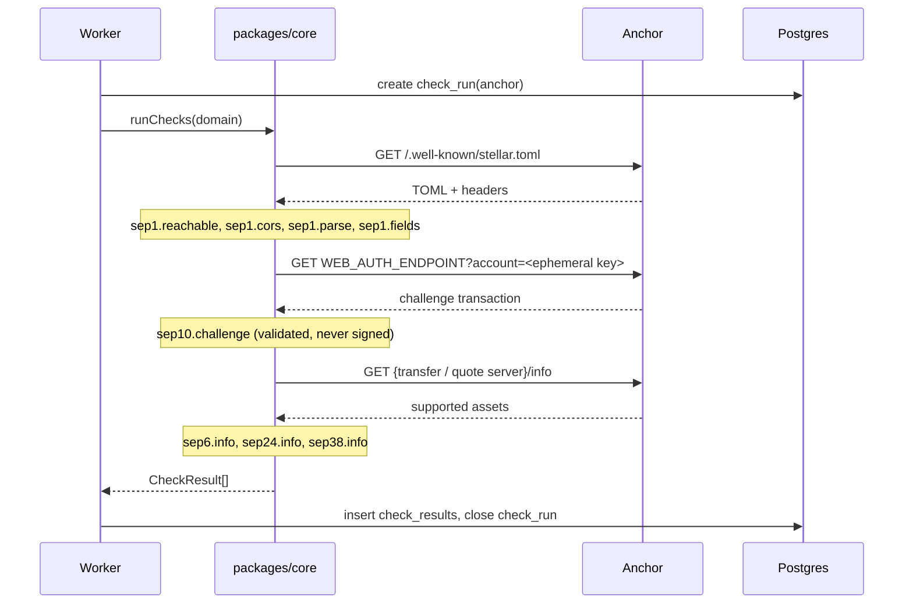

# SEPscope [](https://github.com/<org>/sepscope/actions/workflows/ci.yml) [](LICENSE) [](https://www.typescriptlang.org/) [](https://nodejs.org/)

Open health, compliance, and uptime monitoring for Stellar anchors.

## Overview

Anchors are the on- and off-ramps of the Stellar network. They connect Stellar assets such as USDC and EURC to bank accounts, mobile money, and cash. Wallets integrate anchors through a set of Stellar Ecosystem Proposals (SEPs), but there is no public, continuously updated view of whether a given anchor is online, whether its SEP endpoints behave as the specifications require, or which assets it currently supports.

SEPscope fills that gap. It reads each anchor's `stellar.toml`, discovers the SEP endpoints the anchor declares, runs a suite of specification checks against them on a schedule, and publishes the results through a public dashboard and an open REST API.

**Who it is for:**

- **Wallet and app developers** choosing which anchors to integrate, or debugging a failing integration.
- **Anchor operators** confirming that their endpoints are compliant and reachable from the outside.
- **Ecosystem researchers** tracking anchor coverage and reliability over time.

**Design principles:**

- **Read-only.** SEPscope never completes KYC, submits transactions, or moves funds. The only key it creates is a throwaway, unfunded keypair used to request a SEP-10 challenge.
- **Polite.** At most one request per second to any host, a descriptive `User-Agent`, and strict timeouts.
- **Transparent.** Every result stores its latency and raw error, so a failing check can be verified independently.
- **Open data.** Everything on the dashboard is also available through the API.

### System Architecture



### Check Run Flow



## Components

| Component | Path | Description | Stack |
|---|---|---|---|
| Core | `packages/core` | Pure check implementations, TOML parsing, scoring functions | TypeScript, `smol-toml`, `@stellar/stellar-sdk` |
| Worker | `apps/worker` | Syncs the anchor registry and runs checks on a schedule | Node.js, Drizzle ORM |
| API | `apps/api` | Public read-only REST API with OpenAPI docs | Fastify, Zod |
| Dashboard | `apps/web` | Public dashboard for anchors and check results | Next.js (App Router), Tailwind |
| Registry | `anchors.json` | The list of monitored anchors | JSON, validated with Zod |

## Checks

| Check ID | Spec | Passes when | Skipped when |
|---|---|---|---|
| `sep1.reachable` | SEP-1 | `https://<domain>/.well-known/stellar.toml` returns HTTP 200 over HTTPS | Never |
| `sep1.cors` | SEP-1 | The response includes `Access-Control-Allow-Origin: *` | The toml is unreachable |
| `sep1.parse` | SEP-1 | The file is valid TOML | The toml is unreachable |
| `sep1.fields` | SEP-1 | `NETWORK_PASSPHRASE` and `SIGNING_KEY` are present, and every declared endpoint is a valid HTTPS URL | The toml does not parse |
| `sep10.challenge` | SEP-10 | The challenge is signed by `SIGNING_KEY` and has the correct network, home domain, and time bounds | `WEB_AUTH_ENDPOINT` is not declared |
| `sep6.info` | SEP-6 | `GET {TRANSFER_SERVER}/info` returns a valid response | `TRANSFER_SERVER` is not declared |
| `sep24.info` | SEP-24 | `GET {TRANSFER_SERVER_SEP0024}/info` returns a valid response | `TRANSFER_SERVER_SEP0024` is not declared |
| `sep38.info` | SEP-38 | `GET {ANCHOR_QUOTE_SERVER}/info` returns a valid response | `ANCHOR_QUOTE_SERVER` is not declared |

Each check produces one of four statuses: `pass`, `warn` (works, but deviates from the spec in a non-breaking way), `fail`, or `skipped` (the anchor does not declare that capability, which is not counted against it).

## Architecture

### packages/core

All check logic lives here, as pure functions with no database or scheduler dependencies, so each check can be unit-tested with mocked HTTP. Every check implements the same interface:

```ts
interface Check {
  id: string;                       // e.g. "sep24.info"
  dependsOn?: string[];             // e.g. ["sep1.parse"]
  run(ctx: CheckContext): Promise<CheckResult>;
}

interface CheckResult {
  checkId: string;
  status: "pass" | "warn" | "fail" | "skipped";
  latencyMs?: number;
  detail?: unknown;                 // e.g. the list of supported assets
  error?: string;                   // human-readable failure reason
}
```

Checks declare their dependencies, so a failed toml fetch skips the checks that need it instead of producing a cascade of misleading failures. Adding a new check means adding one file and registering it.

### apps/worker

The worker syncs `anchors.json` into the database on start and then runs every anchor's checks every `CHECK_INTERVAL_MINUTES`. It checks at most four anchors at once and never sends more than one request per second to the same host. Each check's outcome is isolated: an exception in one check is recorded as a `fail` for that check and never aborts the rest of the run.

### apps/api

A read-only Fastify server. All responses are validated with Zod schemas, which also generate the OpenAPI document served at `/docs`. GET requests are open to any origin (CORS) and rate-limited per IP.

### apps/web

A Next.js dashboard that reads only from the API. It has two views: a sortable table of all anchors, and a detail page per anchor with a card for each check.

### Data model

| Table | Key columns | Purpose |
|---|---|---|
| `anchors` | `id`, `domain`, `network`, `name` | One row per monitored anchor |
| `check_runs` | `id`, `anchor_id`, `started_at`, `finished_at` | One row per scheduled run of an anchor |
| `check_results` | `run_id`, `check_id`, `status`, `latency_ms`, `detail`, `error` | One row per check within a run |

### Scoring

- **Score:** the percentage of non-skipped checks that passed in the anchor's latest run.
- **Uptime:** the percentage of `sep1.reachable` passes over the last 24 hours and 7 days.

Both are implemented as pure functions in `packages/core/src/scoring.ts`.

## Getting Started

### Prerequisites

| Tool | Install |
|---|---|
| Node.js (LTS, 22+) | [nodejs.org](https://nodejs.org/) |
| pnpm | `corepack enable` |
| Docker (recommended) | [docs.docker.com](https://docs.docker.com/get-docker/) |
| Postgres 16 (manual setup only) | [postgresql.org](https://www.postgresql.org/download/) |

### Quick Start (Docker)

The fastest way to run the full stack:

```bash
git clone https://github.com/<org>/sepscope.git
cd sepscope
cp .env.example .env
docker compose up --build
```

- Dashboard: <http://localhost:3000>
- API: <http://localhost:8080/v1/anchors>
- API docs: <http://localhost:8080/docs>

The first results appear once the first check interval completes.

### Manual Setup

```bash
git clone https://github.com/<org>/sepscope.git
cd sepscope
pnpm install
cp .env.example .env        # point DATABASE_URL at your Postgres
pnpm db:migrate
pnpm dev                    # runs worker, api, and web together
```

### Test

Run unit tests (mocked HTTP, no network access needed):

```bash
pnpm test
```

Run live integration tests against `testanchor.stellar.org`:

```bash
RUN_LIVE_TESTS=1 pnpm test
```

### Build

```bash
pnpm build
```

## Configuration

All configuration is read from environment variables. See `.env.example` for the full list.

| Variable | Default | Description |
|---|---|---|
| `DATABASE_URL` | — | Postgres connection string |
| `CHECK_INTERVAL_MINUTES` | `15` | How often each anchor is checked |
| `API_PORT` | `8080` | Port for the API server |
| `NEXT_PUBLIC_API_URL` | `http://localhost:8080` | API base URL used by the dashboard |
| `LOG_LEVEL` | `info` | pino log level |
| `RUN_LIVE_TESTS` | unset | Set to `1` to run tests against live anchors |

## Deployment

### Docker Compose

`docker-compose.yml` runs Postgres, the worker, the API, and the dashboard. Migrations run automatically when the worker and API start. For production, set real values in `.env`, put a TLS-terminating reverse proxy in front of the API and dashboard, and back up the Postgres volume.

### Render (one-click)

The repository includes a `render.yaml` blueprint that creates a managed Postgres database, the API as a web service, and the worker as a background worker.

1. Fork the repository.
2. In Render, choose **New → Blueprint** and select your fork.
3. Set `NEXT_PUBLIC_API_URL` once the API URL is known.

### Dashboard on Vercel

1. Import the repository into Vercel and set the root directory to `apps/web`.
2. Set `NEXT_PUBLIC_API_URL` to your deployed API URL.

## Example Usage

### List all anchors

```bash
curl https://<your-api>/v1/anchors
```

```json
[
  {
    "domain": "testanchor.stellar.org",
    "network": "testnet",
    "score": 100,
    "uptime24h": 100,
    "uptime7d": 99.4,
    "lastCheckedAt": "2026-09-21T09:15:02Z"
  }
]
```

### Get an anchor's latest results

```bash
curl https://<your-api>/v1/anchors/testanchor.stellar.org
```

```json
{
  "domain": "testanchor.stellar.org",
  "score": 100,
  "checks": [
    { "checkId": "sep1.cors", "status": "pass", "latencyMs": 142 },
    { "checkId": "sep24.info", "status": "pass", "latencyMs": 311,
      "detail": { "deposit": ["SRT", "USDC"], "withdraw": ["SRT", "USDC"] } }
  ]
}
```

### Get the history of one check

```bash
curl "https://<your-api>/v1/anchors/testanchor.stellar.org/history?check=sep24.info&range=7d"
```

### Add an anchor

Add an entry to `anchors.json` and open a pull request:

```json
{ "domain": "example-anchor.com", "network": "pubnet", "name": "Example Anchor" }
```

The worker picks it up on its next start.

## Troubleshooting

**An anchor fails `sep1.cors`, but its toml loads fine in a browser.**
Browsers show the file even when the CORS header is missing. Wallets running in the browser, however, cannot read it. The anchor must serve `Access-Control-Allow-Origin: *` on `stellar.toml`, as SEP-1 requires.

**Every check for every anchor times out.**
The worker cannot reach the internet. Check outbound network access, proxy settings, and DNS in the environment where the worker runs.

**The dashboard shows no anchors.**
Make sure the worker is running and has completed at least one interval, and that `NEXT_PUBLIC_API_URL` points at the API. Check the worker logs with `docker compose logs worker`.

**The worker exits on startup with a validation error.**
An entry in `anchors.json` is invalid. The error message names the entry and the field.

## FAQ

**Does SEPscope ever move funds or submit transactions?**
No. It only makes read-only HTTP requests. The SEP-10 check requests a challenge using a random, unfunded key and validates it without signing it.

**Why is a check marked "skipped"?**
The anchor does not declare the endpoint that check needs in its `stellar.toml`. Skipped checks do not lower an anchor's score.

**How is the score calculated?**
It is the percentage of non-skipped checks that passed in the latest run. See [Scoring](#scoring).

**I operate an anchor and think a result is wrong. What should I do?**
Open an issue with the anchor's domain and the check ID. Every result stores its raw error and latency, which makes disputes easy to verify.

**Does SEPscope cover both testnet and pubnet?**
Yes. Each anchor in `anchors.json` declares its network, and the dashboard can filter by network.

## Contributing

Contributions are welcome, from new checks and dashboard improvements to adding anchors to the registry.

1. Read [CONTRIBUTING.md](CONTRIBUTING.md) for setup, coding conventions, and the pull request process.
2. Pick an issue from the tracker or from [ROADMAP.md](ROADMAP.md). Issues labelled `good first issue` are a good starting point.
3. Make sure `pnpm lint`, `pnpm typecheck`, and `pnpm test` pass before opening a pull request.

Planned work includes SEP-10 token exchange, SEP-12 and SEP-31 checks, fee and corridor comparison, alerting webhooks for anchor operators, and embeddable status badges.

## Security

To report a vulnerability, follow [SECURITY.md](SECURITY.md). Please do not open a public issue.

## License

[Apache-2.0](LICENSE)
